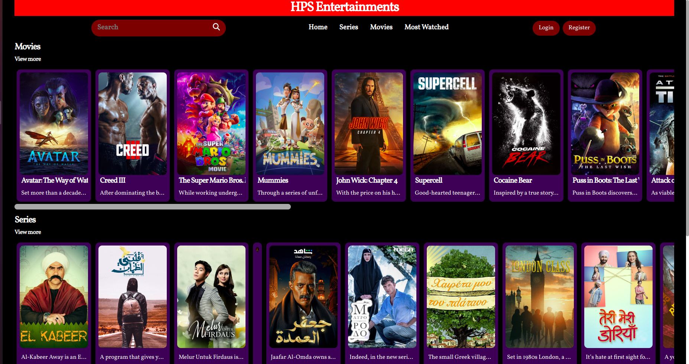

# HPS Entertainments

A simple static website that utilizes a publicly available api to lists the top web-series, movies and most watched. Also gives a little to read about on selecting any of them with data sent by api.

A good project to start with, gives a basic understanding on the NextJs working, uses a publicly available API. Handles load, and UI.


## Run Locally

Clone the project

```bash
  git clone https://github.com/shashank-crypto/hps
```

Go to the project directory

```bash
  cd hps
```

Install dependencies

```bash
  npm install
```

Start the server

```bash
  npm run dev
```


## Screenshots




## Features

- Lists Most Watched 
- Can read about and also get available trailers
- Lists out the tags
- Good and basic use of movie API


## Authors

- [@shashank-crypto](https://www.github.com/shashank-crypto)

